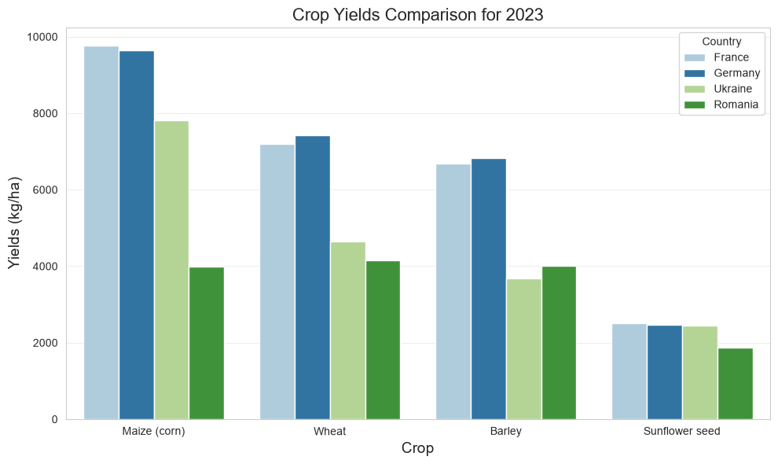
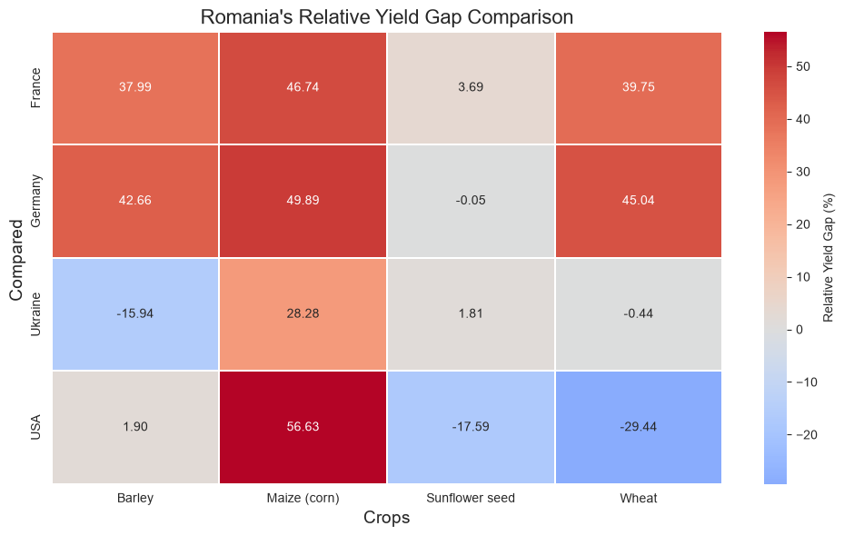
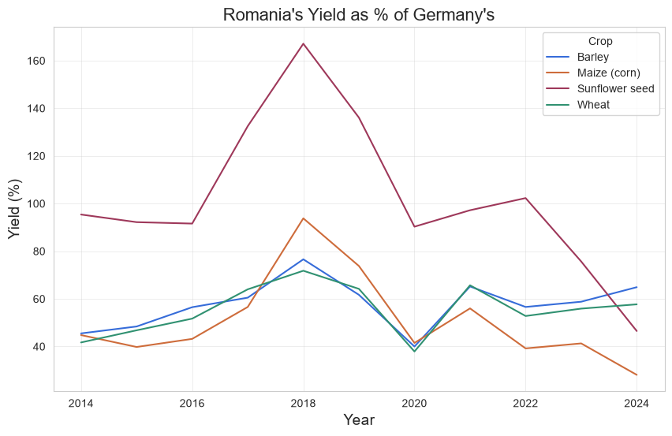
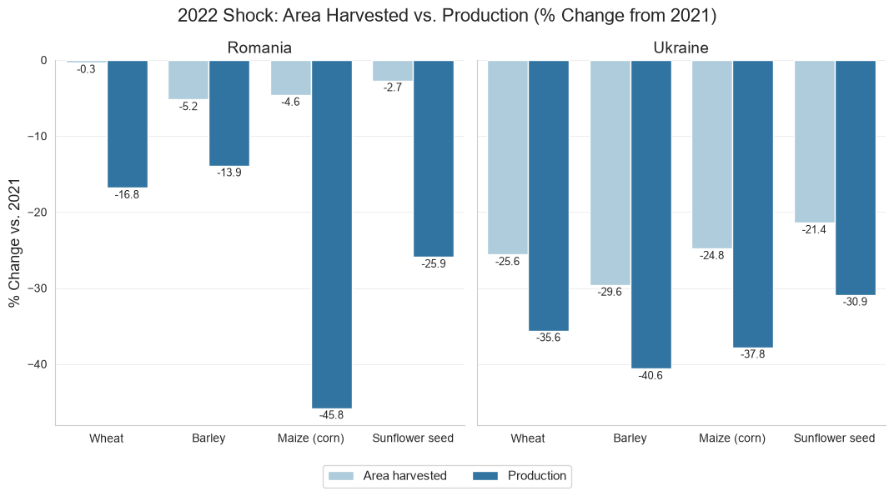
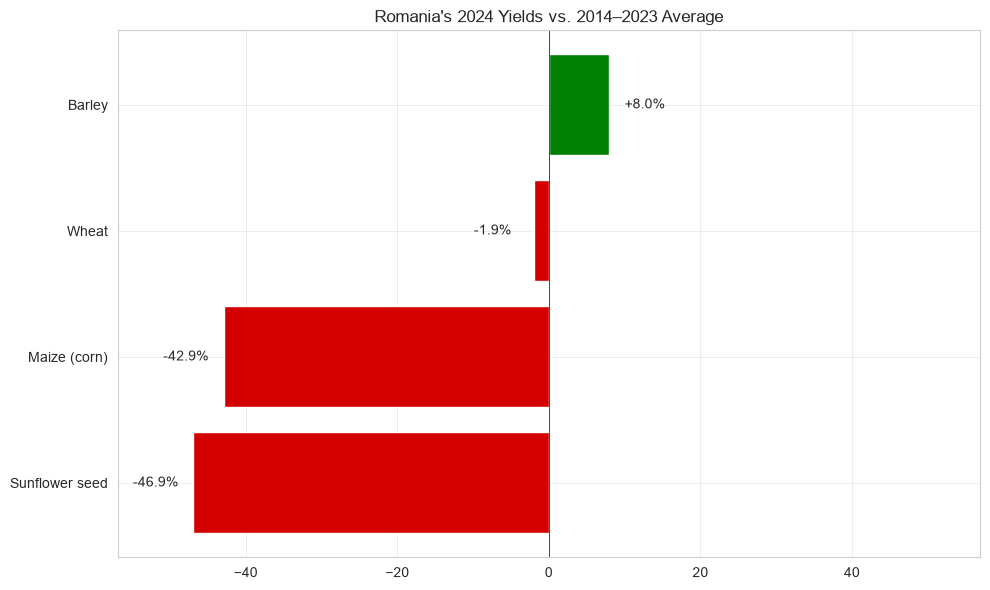

# Romania's Crop Yield Gap

**Benchmarking Wheat, Maize, Barley, and Sunflower Seed Against Major Producers (2014–2024)**

A SQL + Python analysis of how Romania's crop yields, land productivity, and market resilience compare to France, Germany, Ukraine, and the United States, built on FAOSTAT data, queried through a self-built SQLite database, and analyzed in pandas.

## The Question

Where does Romania sit between the Black Sea grain belt and the highly mechanized systems of Western Europe and the US, and a decade into EU membership's capital and subsidy flows. Is the gap closing or widening?

**Short answer:** Romania sits much closer to Ukraine than to Western Europe on three of its four core crops, the gap to Germany has not meaningfully closed over the decade, converting yield to dollar terms doesn't change the ranking, and Romania has now absorbed two separate drought shocks (2022 and 2024) on top of the war disrupting its neighbor.

## Why These Countries, These Crops, This Decade

- **Romania vs. Ukraine** — the two countries share the Black Sea grain belt's agro-climatic zone, which makes yield comparisons fair. Ukraine also matters directly to Romania's own logistics: once Russia blocked Ukraine's Black Sea ports in 2022, a significant share of Ukrainian grain exports rerouted through Romania's port of Constanța.
- **Romania vs. France & Germany** — both operate under the same EU Common Agricultural Policy and subsidy framework as Romania, which controls for policy differences. Any yield gap that remains reflects structure and technology, not different levels of EU support.
- **Romania vs. USA** — the global technological benchmark, with the highest precision-agriculture adoption of the group, used here as a ceiling reference for how far a yield gap can realistically go.
- **Crops** — wheat, maize, barley, and sunflower seed are Romania's core row crops and main agricultural exports.
- **2014–2024** — the window opens with Russia's annexation of Crimea, runs through the 2022 full-scale invasion and its aftermath, and closes on 2024, the most recent full year available and itself a major Romanian drought year. That gives the decade two real shocks and several drought years to analyze.

## Key Findings

### 1. Romania sits closer to Ukraine than to Western Europe

Averaged across the full 2014–2024 window, Romania's yield gap to each peer, per crop, looks like this (positive = Romania trails that peer, negative = Romania leads it):

| | Barley | Maize (corn) | Sunflower seed | Wheat |
|---|---:|---:|---:|---:|
| France | +38% | +47% | +4% | +40% |
| Germany | +43% | +50% | ~0% | +45% |
| Ukraine | −16% | +28% | +2% | ~0% |
| USA | +2% | +57% | −18% | −29% |

Romania consistently lags France and Germany by roughly 40–50%, on every crop except sunflower, where it's essentially tied with all four peers. Ukraine is the one country that flips by crop: it out-yields Romania on maize but trails it on barley, and the two are close on sunflower and wheat, a pattern that likely reflects the war's disruption to Ukraine's own land and harvested area since 2021 as much as any structural difference. The USA is the most extreme comparison in both directions: the largest deficit Romania has anywhere is on maize against the US, and the largest lead it has anywhere is on wheat and sunflower against the same country.

### 2. The gap to Germany

Tracking Romania's yield as a percentage of Germany's, year by year:

| Crop | 2014 | 2018 | 2020 | 2022 | 2024 |
|---|---:|---:|---:|---:|---:|
| Barley | 45.5% | 76.6% | 40.0% | 56.6% | 64.9% |
| Maize (corn) | 44.8% | 93.8% | 41.5% | 39.2% | 28.1% |
| Sunflower seed | 95.4% | 167.1% | 90.3% | 102.3% | 46.5% |
| Wheat | 41.7% | 71.8% | 37.9% | 52.8% | 57.7% |

Romania trailed Germany on every crop across the whole decade, with sunflower seed as the one exception: it cleared Germany's yield twice, a sustained peak in 2017–2019 (167% in 2018) and a brief return above parity in 2022 (~102%), before falling to less than half of Germany's yield by 2024. Barley and wheat moved together for the whole period, on a gradual upward trend from roughly 40–45% in 2014 to 58–65% by 2024, so the gap to Germany narrowed on those two crops even if it didn't close. Maize and sunflower, by contrast, widened sharply from 2018 to 2024 with no recovery. 2020 stands out as a shared low point across all four crops.

- **2020**: Romania's own yields fell 33–39% year-over-year across all four crops, while Germany's were flat to slightly up, a real collapse in Romania's production, consistent with the drought reported across south-eastern Europe that year.
- **2018**: Romania's yields held steady or grew (maize +28%), while Germany's fell 13–23% across all crops amid its own drought conditions. The 167% sunflower spike reflects genuine gains in Romania and genuine losses in Germany happening at the same time.

### 3. Converting yield to dollar terms doesn't change the ranking

Production value per hectare (producer price × production ÷ area harvested), averaged 2014–2024:

| Country | Barley | Maize (corn) | Sunflower seed | Wheat |
|---|---:|---:|---:|---:|
| France | $1,297 | $1,869 | $1,191 | $1,505 |
| Germany | $1,299 | $2,020 | $879 | $1,619 |
| USA | $996 | $1,839 | $862 | $672 |
| Romania | $864 | $968 | $859 | $844 |
| Ukraine | $510 | $1,081 | $848 | $674 |

| Crop | Yield rank | Value/ha rank | Change |
|---|---:|---:|---:|
| Barley | 4th | 4th | — |
| Maize (corn) | 5th (last) | 5th (last) | — |
| Sunflower seed | 3rd | 4th | −1 |
| Wheat | 3rd | 3rd | — |

Romania's standing on land productivity mirrors its standing on raw yield for three of the four crops: last on maize, mid-pack on barley and wheat, regardless of whether output is measured in kg/ha or USD/ha. The one shift is sunflower seed, and it's a near-tie rather than a meaningful gap: Romania's $859/ha trails the USA's $862/ha by under 1%, so the single rank position it drops doesn't reflect a real productivity difference. Ukraine's producer prices are missing for 2024 across all four crops, so its average here is built on 10 of the 11 years, not the full window like the other four countries.

### 4. Droughts and Ukraine's war effects on Romania

How Romania's and Ukraine's production and area harvested moved in 2022 (% change from 2021):

| | Area harvested | Production |
|---|---:|---:|
| **Romania** — Barley | −5.2% | −13.9% |
| **Romania** — Maize (corn) | −4.6% | −45.8% |
| **Romania** — Sunflower seed | −2.7% | −25.9% |
| **Romania** — Wheat | −0.3% | −16.8% |
| **Ukraine** — Barley | −29.6% | −40.6% |
| **Ukraine** — Maize (corn) | −24.8% | −37.8% |
| **Ukraine** — Sunflower seed | −21.4% | −30.9% |
| **Ukraine** — Wheat | −25.6% | −35.6% |

Ukraine's 2022 area harvested fell sharply alongside its production, a signature of losing physical access to land, consistent with the war. Romania's harvested area barely moved (down 5% at most), while its production still fell hard, especially on maize, which points to a yield shock rather than a land shock. That lines up with independent reporting: Romania's 2022 wheat harvest came in at roughly 9 million tonnes, down from a record 11.3 million tonnes in 2021, with the country's agriculture ministry attributing the drop to a summer of high heat and prolonged drought that damaged crops across the grain belt ([World Grain, Aug 2022](https://www.world-grain.com/articles/17377-drought-slashes-romanias-wheat-crop)). So the 2022 production drops share a year but not a cause: Ukraine's is war related, Romania's is drought years related.

Romania's 2024 harvest against the rest of the decade:

| Crop | 2014–2023 avg (kg/ha) | 2024 (kg/ha) | % vs. decade avg |
|---|---:|---:|---:|
| Maize (corn) | 4,958 | 2,829 | −42.9% |
| Sunflower seed | 2,284 | 1,213 | −46.9% |
| Wheat | 4,169 | 4,091 | −1.9% |
| Barley | 3,840 | 4,149 | +8.0% |

Maize and sunflower each hit their single lowest yield of the entire 2014–2024 window in 2024; barley and wheat, both harvested earlier in the summer, came in close to normal. That split matches external coverage of the year: the European Commission's autumn 2024 forecast cut Romania's expected corn yield to around 3 tonnes/ha (a 36% year-over-year drop) and its sunflower yield to roughly 1.54 tonnes/ha (18% below the prior year), attributing the damage to extreme summer heat and prolonged drought concentrated in the country's southern and eastern growing regions, the same regions and the same later-harvested crops this dataset shows taking the hit ([Romania Insider, Nov 2024](https://www.romania-insider.com/european-commission-romania-grain-crop-down-2024)).

## Data & Method

**Source**: two normalized bulk-download datasets from [FAOSTAT](https://www.fao.org/faostat)

**Tools**: Python, `sqlite3`, pandas, matplotlib/seaborn, Jupyter Notebook

## Limitations & Caveats

- **These are national annual averages.** FAOSTAT reports one yield number per country per year, which smooths over real internal variation. Romania's own agriculture splits sharply between better-irrigated western regions and the drought-exposed southeast (Bărăgan, Dobrogea), and a single national figure hides that divide.
- **Producer prices are farm-gate annual averages**, not futures or spot market prices, so the Tier 3 "value per hectare" figures reflect what an average seller realized across the year, not what any individual farmer captured on a given sale.

## Sources Referenced for the 2022 and 2024 Anomalies

- ["Drought slashes Romania's wheat crop"](https://www.world-grain.com/articles/17377-drought-slashes-romanias-wheat-crop), World Grain, Aug 2022
- ["EC revises downward Romania's grain crop forecast"](https://www.romania-insider.com/european-commission-romania-grain-crop-down-2024), Romania Insider, Nov 2024
- ["Romania's corn and sunflower crops severely impacted by drought"](https://www.romania-insider.com/romania-corn-sunflower-crops-drought-2024), Romania Insider, Jul 2024
